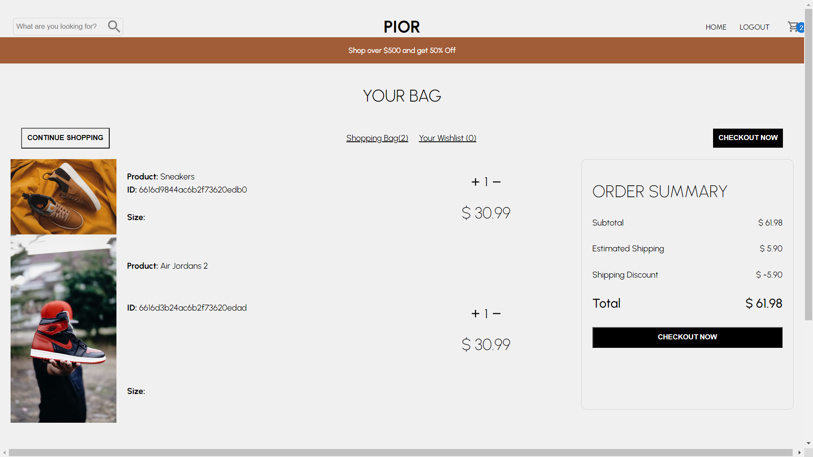
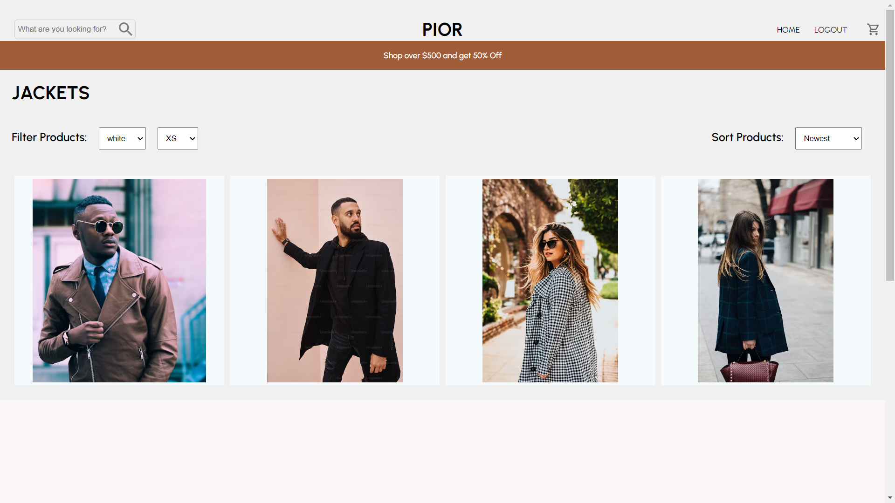
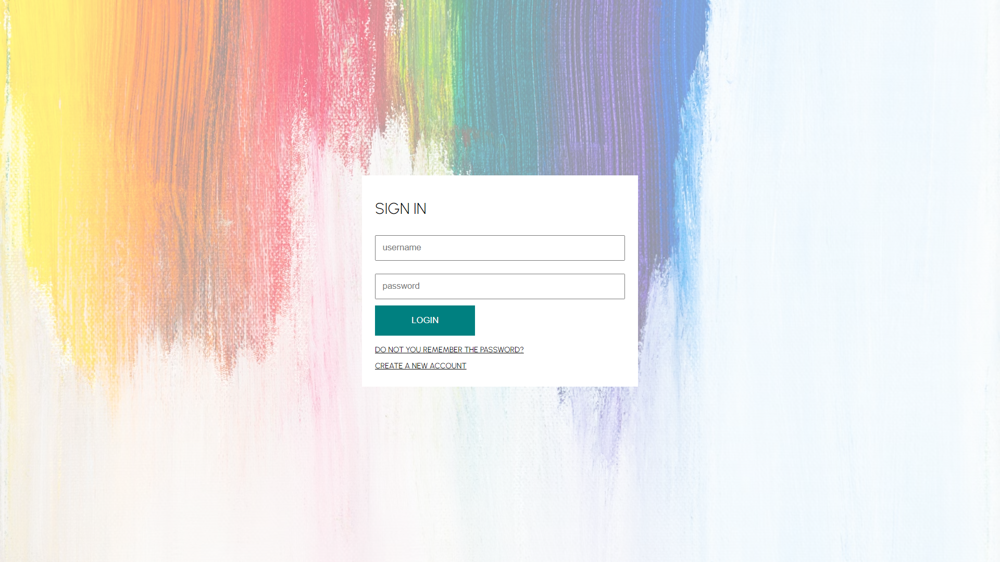

# PIOR | eCommerce Project

Welcome to our eCommerce project built with the MERN stack! This application allows users to browse, filter, and purchase products, leveraging Stripe for secure payment processing and JWT for user authentication.

## Table of Contents

- [Features](#features)
- [Prerequisites](#prerequisites)
- [Installation](#installation)
- [Usage](#usage)
- [Screenshots](#screenshots)

## Features

- **Product Catalog:** Browse through a wide range of products.
- **Filtering:** Easily filter products based on categories, prices, etc.
- **User Authentication:** Secure user authentication using JWT.
- **Shopping Cart:** Add products to the cart for later purchase.
- **Checkout:** Seamlessly proceed to checkout and complete orders.
- **Payment Integration:** Integrated with Stripe for secure payment processing.

## Prerequisites

Before you begin, ensure you have met the following requirements:
- Node.js installed on your machine.
- MongoDB Atlas account or local MongoDB server running.
- Stripe account for payment integration.

## Installation

1. **Clone the repository**:
   ```bash
   git clone https://github.com/DeepeshRajdev/e-commerce.git
   ```
2. **Navigate to the project directory**:
  ```bash
     cd e-commerce
  ```
3. **Install dependencies for the client and server**:
```bash
cd frontend && npm install
cd ../backend && npm install
```
4. **Configure environment variables**:

- Create a .env file in the server directory.
- Add environment variables for MongoDB connection URL, JWT secret, and Stripe API keys.

## Usage
1. Start the server:
   ```bash
   cd backend && npm run start
   ```
2. Start the client:
   ```bash
   cd frontend && npm run dev
   ```
3. Open your browser and navigate to http://localhost:3000 to access the application.

## Screenshots










  


